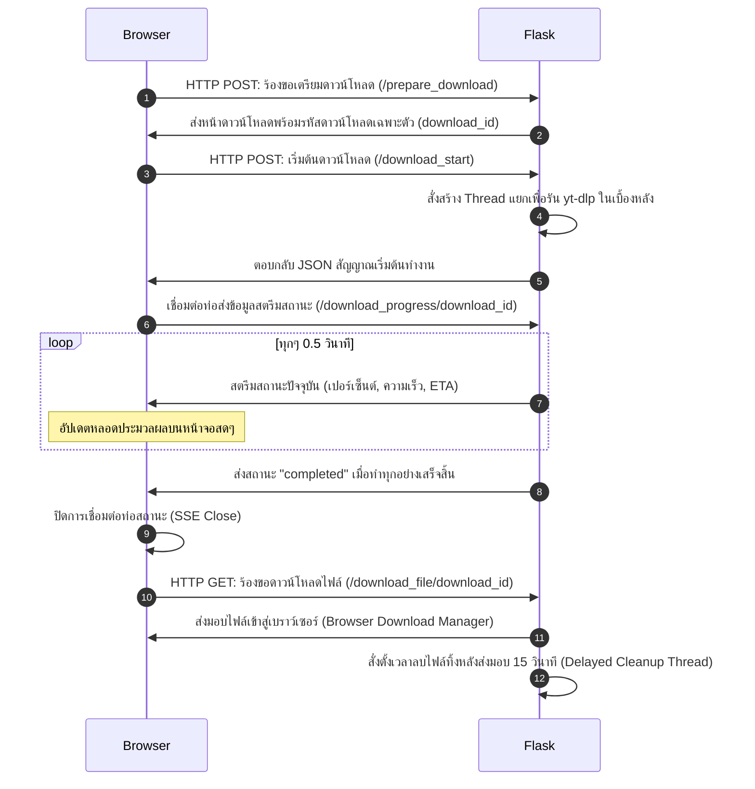

# 🌐 Universal Video & Audio Downloader — System Architecture

แอปพลิเคชันดาวน์โหลดวิดีโอและเสียงประสิทธิภาพสูง ทำงานแบบ Local Web Application (ทำงานในเครื่องคอมพิวเตอร์ของผู้ใช้โดยตรง) พัฒนาด้วยภาษา Python (Flask) ร่วมกับแกนดาวน์โหลดประสิทธิภาพสูง `yt-dlp` และตัวแปลงสัญญาณสัญญาณ `FFmpeg` พร้อมส่วนติดต่อผู้ใช้สไตล์ Retro-Pixel ที่มีสีสันสวยงาม เข้าใจง่าย และแสดงผลสถานะแบบเรียลไทม์

---

## 🏗️ แผนภาพสถาปัตยกรรมระบบ (System Architecture)

แผนภาพต่อไปนี้แสดงโครงสร้างสถาปัตยกรรมและการโต้ตอบระหว่างแต่ละส่วนประกอบของระบบ (Components)

```mermaid
graph TD
    %% Frontend Components
    subgraph Client Browser [เว็บเบราว์เซอร์ของผู้ใช้]
        UI[Retro-Pixel UX/UI HTML & CSS]
        AJAX[JavaScript Fetch / API Call]
        SSE[EventSource Client / SSE Listener]
    end

    %% Backend Flask Components
    subgraph Flask Local Server [เซิร์ฟเวอร์ควบคุมภายในเครื่อง]
        APP[app.py - Flask Controller]
        MW[check_ffmpeg Middleware]
        CORE_LOAD[Dynamic Engine Loader]
        TH_MGR[Background Thread Manager]
        TR_MGR[Session & Progress Tracker]
    end

    %% Execution Engine
    subgraph Downloader Core [แกนประมวลผล]
        YTDL[yt_dlp Library Core]
        FFMPEG[FFmpeg Essentials Binary]
    end

    %% Target Sources
    subgraph Target Websites [เว็บไซต์ปลายทาง]
        YT[YouTube API / Streams]
        TT[TikTok Streams]
        MA[MissAV Stream / M3U8]
        OTHER[1,000+ Video/Audio Sites]
    end

    %% Connections
    UI --> AJAX
    UI --> SSE
    AJAX -->|1. ขอข้อมูล / เริ่มดาวน์โหลด| APP
    SSE -->|3. ติดตามสถานะแบบสด| APP
    APP --> MW
    MW -->|ตรวจหา| FFMPEG
    APP --> CORE_LOAD
    CORE_LOAD -->|โหลดแกนนำเข้า| YTDL
    APP --> TH_MGR
    TH_MGR -->|รันเบื้องหลัง| YTDL
    YTDL -->|ดึงข้อมูลมัลติมีเดีย| Target Websites
    YTDL -->|รวมไฟล์ / แปลงไฟล์| FFMPEG
    YTDL -->|2. รายงานสถานะ| TR_MGR
    TR_MGR -->|4. ส่งข้อมูลสถานะเรียลไทม์| SSE
```

---

## 🧩 ส่วนประกอบสำคัญของระบบ (Key Components)

### 1. **Client Browser Interface (Frontend)**
- **Retro-Pixel UX/UI:** พัฒนาด้วย HTML5, CSS3 (Vanilla CSS) และ Bootstrap 5 นำเสนอการจัดระบบสีที่มีความเปรียบต่างสูง (Contrast-friendly) และจัดเรียงฟอนต์ให้อ่านง่าย โดยใช้ฟอนต์ Sans-serif ทั่วไปสำหรับคำอธิบายยาวๆ และคงฟอนต์ `VT323` สำหรับข้อมูลตัวเลขและหัวข้อหลัก
- **EventSource & SSE:** เบราว์เซอร์ใช้ JavaScript `EventSource` ในการเชื่อมต่อท่อส่งข้อมูลแบบทางเดียว (Server-Sent Events) เพื่อแสดงความคืบหน้าการทำงานเรียบลำดับ เช่น เปอร์เซ็นต์การดาวน์โหลด, ความเร็วอินเทอร์เน็ต (Speed), และเวลาที่เหลือ (ETA) โดยไม่ต้องรีเฟรชหน้าจอ

### 2. **Flask Local Server (Backend Controller)**
- **Middleware Check:** คอยดักจับ Request บนเครื่องโลคอลเพื่อตรวจสอบว่ามี `ffmpeg.exe` หรือไม่ หากไม่มี จะเปลี่ยนเส้นทาง (Redirect) ไปหน้าติดตั้ง `/setup` ทันที
- **Multi-threaded Worker:** เมื่อผู้ใช้สั่งดาวน์โหลด ไฟล์ดาวน์โหลดจะถูกส่งไปรันบนโปรเซส Thread แยกเบื้องหลัง เพื่อให้หน้าเว็บสามารถสตรีมข้อมูลสถานะได้โดยไม่ทำให้หน้าระบบค้าง
- **Session Manager:** สร้างรหัส ID เฉพาะกิจ (UUID) เพื่อแยกพื้นที่การดาวน์โหลดของแต่ละ Request ในรูปโฟลเดอร์แยก ป้องกันปัญหาไฟล์ซ้ำหรือการดาวน์โหลดชนกัน
- **Graceful Shutdown:** ระบบรองรับคำสั่งปิดตัวเองผ่าน Route `/shutdown` ซึ่งจะไปฆ่าการทำงานของโปรเซสหลักในแรม เพื่อคืนพอร์ต `5000` ทันทีที่ผู้ใช้กดปุ่ม Close App

### 3. **Downloader Engine (Core Processing)**
- **yt-dlp (Dynamic Core):** แกนกลางที่ใช้ดึงที่อยู่ไฟล์มัลติมีเดีย รองรับการดึงข้อมูลจากเว็บไซต์ยอดนิยมกว่า 1,000 แห่ง และมีสคริปต์อัปเดตเวอร์ชันใหม่จาก PyPI อัตโนมัติ โดยระบบจะทำการโหลดแกนตัวใหม่ผ่าน `bin/yt-dlp-update` เสมอหากผู้ใช้กดปุ่มอัปเดต
- **FFmpeg Engine:** ใช้ตัดต่อ รวมสัญญาณภาพ HD/4K และเสียงเข้าด้วยกัน แปลงไฟล์เป็น MP3 ตามบิตเรตที่กำหนด (128k, 192k, 320k) รวมถึงการฝังซับไตเติล (Subtitles Embed)

---

## 🔄 ลำดับการดาวน์โหลดแบบมีสถานะเรียลไทม์ (Live Download Stream Flow)



---

## 🛠️ วิธีการติดตั้งเพื่อพัฒนาและทดสอบ (Development Guide)

### 1. **สิ่งที่ต้องเตรียม (Prerequisites)**
- Python เวอร์ชัน 3.8 หรือสูงกว่า
- บัญชีใช้งาน Git

### 2. **ขั้นตอนการเริ่มรันระบบโลคอล**
```bash
# 1. โคลนคลังโค้ดลงมาในเครื่อง
git clone https://github.com/ling-gwdgw2/downloading-mp3-mp4.git
cd downloading-mp3-mp4

# 2. สร้าง Virtual Environment
python -m venv .venv
.venv\Scripts\activate

# 3. ติดตั้งไลบรารีที่จำเป็น
pip install -r requirements.txt

# 4. เริ่มรันแอปพลิเคชัน
python app.py
```
*ตัวเซิร์ฟเวอร์จะเริ่มทำงานที่ http://127.0.0.1:5000 และจะเปิดเว็บเบราว์เซอร์ขึ้นมาโดยอัตโนมัติ*

---

## 📦 ขั้นตอนการคอมไพล์เป็นไฟล์เดี่ยวและตัวติดตั้ง (Packaging Guide)

### 1. **คอมไพล์ด้วย PyInstaller**
เราใช้สคริปต์ [build_exe.py](build_exe.py) ในการควบคุมพารามิเตอร์ของ PyInstaller ทั้งหมด (รวมถึงการแนบเทมเพลต HTML/CSS และไลบรารีดักจับคุกกี้ `curl_cffi`):
```bash
python build_exe.py
```
ผลลัพธ์ไฟล์เดี่ยวจะปรากฏขึ้นที่โฟลเดอร์ **`dist/YouTubeDownloader.exe`** โดยรันแบบซ่อนหน้าจอคอนโซลดำ (`--noconsole`)

### 2. **สร้างตัวติดตั้ง Windows ด้วย Inno Setup**
1. ดาวน์โหลดและติดตั้ง **Inno Setup Compiler**
2. เปิดไฟล์สคริปต์ [setup.iss](setup.iss) ผ่านโปรแกรม
3. กดปุ่ม **Compile** (คีย์ลัด F9) เพื่อคอมไพล์โฟลเดอร์ `dist/` ออกมาเป็นไฟล์ติดตั้งตัวเดียว
4. ตัวติดตั้งสำเร็จรูปจะถูกบันทึกไว้ในโฟลเดอร์ **`installer_output/YouTubeDownloaderSetup.exe`** เพื่อนำไปแจกจ่ายและติดตั้งบนคอมพิวเตอร์เครื่องอื่นๆ ได้ทันที