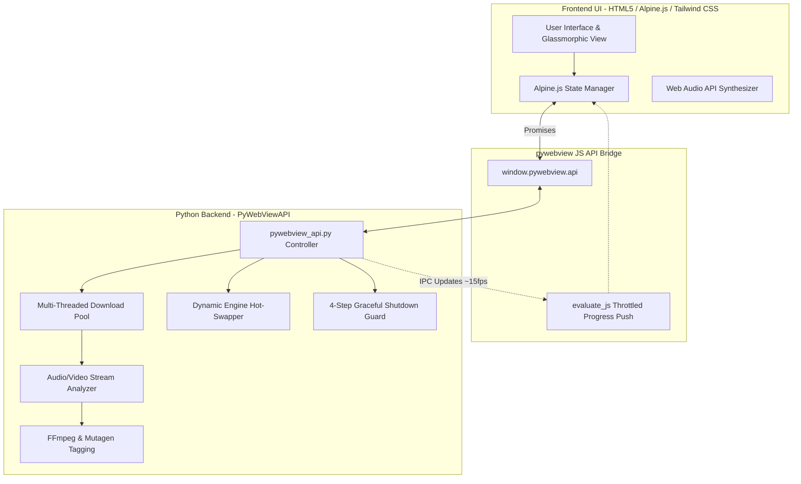
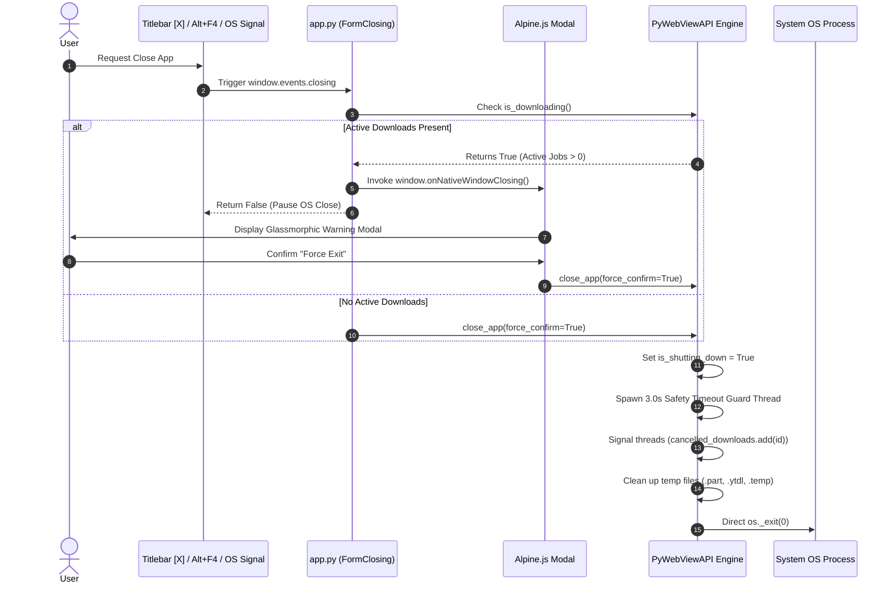

# Phoebe Downloader (v2.3.4) — Technical Architecture & System Report

## 1. Executive Summary

**Phoebe Downloader** is a production-grade, multi-platform media downloading and audio/video processing desktop application. Built with Python 3.11+, `pywebview` (native Windows Forms / WebView2 wrapper), `yt-dlp`, and `FFmpeg`, it delivers a responsive glassmorphic UI powered by Alpine.js and Tailwind CSS without requiring heavy web runtimes like Electron or Chromium binaries.


---

## 2. High-Level Architecture Overview

The system follows a decoupled, 3-tier desktop architecture:



---

## 3. Core Systems & Subsystems

### 3.1. Production-Grade Graceful Shutdown Pipeline (4-Step Guard)
To prevent data corruption, zombie background processes, and `.NET` `System.InsufficientExecutionStackException` recursion bugs, the application enforces a strict 4-step shutdown architecture:



1. **Step 1: Event Interception:** Intercepts native Windows `FormClosing`, `Alt+F4`, and UI events cleanly.
2. **Step 2: State Verification & Confirmation:** Queries thread-safe download counters (`is_downloading()`). If jobs are active, pops a non-native glassmorphic modal while keeping the app responsive.
3. **Step 3: Cleanup & Signal:** Signals thread cancellation via `cancelled_downloads` set, deletes orphaned `.part`/`.ytdl` files, and runs a **3.0-second Safety Timeout Guard** to force exit if thread joins deadlock.
4. **Step 4: Non-Recursive Native Exit:** Terminates the process using `os._exit(0)` cleanly without triggering WinForms event loops.

---

### 3.2. Adaptive High-Resolution Format Extraction (4K / 2K / 1080p / Audio)
- **Unconstrained DASH Selector:** Utilizes `'bestvideo+bestaudio/best'` format selection strings. Removing legacy Android `player_client` restrictions unlocks YouTube's 39+ adaptive DASH video and audio streams.
- **Dynamic Resolution Resolution Parser:** Detects and parses streams up to **2160p (4K)**, **1440p (2K)**, **1080p (Full HD)**, **720p**, and **480p**.

---

### 3.3. Audio Source Analyzer & Transcoding Engine
- **Source Inspection:** Pre-analyzes source audio codecs (Opus, AAC, MP3, Vorbis) and bitrates.
- **Transcoding Options:** Supports high-quality 320kbps MP3 encoding, M4A container extraction, and Lossless FLAC/WAV conversion via `FFmpeg`.
- **ID3 & Metadata Embedding:** Uses `mutagen` to inject title, artist, album art cover, and track metadata into downloaded audio files.

---

### 3.4. Anti-Blocking & Bot Evasion System
- **Browser Impersonation:** Employs `curl_cffi` to mimic Chrome/Safari TLS fingerprints.
- **Request Normalization:** Implements user-agent rotation, custom header sets, PO-token handling, and exponential backoff retry algorithms to avoid YouTube IP rate-limiting.

---

### 3.5. Dynamic Engine Updater (Bypassing PyInstaller `FrozenImporter`)
- **Hot-Swapping Binary Engine:** Checks PyPI for the latest `yt-dlp` version. Downloads new engine updates to `bin/yt-dlp-update`.
- **Importer Bypassing:** Dynamically manipulates `sys.meta_path` to bypass PyInstaller's static `FrozenImporter`, allowing seamless engine upgrades without reinstalling the application `.exe`.

---

### 3.6. IPC Throttling & Progress Rate-Limiter
- **Thread-Safe Rate Limiting:** Limits UI progress updates (`_push_progress`) via `_push_lock` and timestamps to ~15 updates/second (~65ms interval).
- **Immediate Terminal Updates:** Forces immediate evaluation (`force=True`) on critical states (`finished`, `error`, `cancelled`) to guarantee zero UI latency on completion.

---

### 3.7. Packaging & Deployment Subsystem
- **PyInstaller Bundle:** Packaging script (`build_exe.py`) compiles the app into a single standalone executable (`dist/YouTubeDownloader.exe`) with bundled `FFmpeg` binaries and `templates/static` assets.
- **Inno Setup Script (`setup.iss` v2.3.0):** Multi-language Windows installer supporting English, Thai, and Lao. Enforces 64-bit Windows 10+ environments and installs cleanly into `{localappdata}\Programs\Phoebe Downloader`.

---

## 4. Technology Stack Summary

| Layer | Technology / Library | Purpose |
| :--- | :--- | :--- |
| **GUI Wrapper** | `pywebview` 5.x (WebView2 / WinForms) | Lightweight native desktop window wrapper |
| **Frontend Framework** | Alpine.js 3.x + Tailwind CSS | Reactive UI state management & glassmorphic styling |
| **Backend Core** | Python 3.11+ | Application logic, threading, and system APIs |
| **Extractor Engine** | `yt-dlp` | Video/audio stream extraction & downloading |
| **Media Converter** | `FFmpeg` | Video/audio merging, format conversion & normalization |
| **Metadata Processor** | `mutagen` | ID3, MP4, FLAC audio metadata & cover art tagging |
| **Network Client** | `curl_cffi` | TLS fingerprint impersonation for anti-bot evasion |
| **Installer** | Inno Setup 6.x (`setup.iss`) | Production Windows installer packaging |

---

## 5. File & Directory Map

```
youtube mp3 mp4/
├── app.py                      # Main entry point & PyWebView window initialization
├── pywebview_api.py            # Backend Native API Controller & Processing Engine
├── build_exe.py                # PyInstaller build automation script
├── setup.iss                   # Inno Setup 6 installer specification script (v2.3.0)
├── templates/
│   ├── index.html              # Main Alpine.js UI layout & controllers
│   ├── setup.html              # FFmpeg initial setup wizard interface
│   └── static/                 # Embedded asset directory (phoebe0.png, phoebe1.png, etc.)
└── bin/                        # Binary executables directory (ffmpeg.exe, ffprobe.exe)
```
