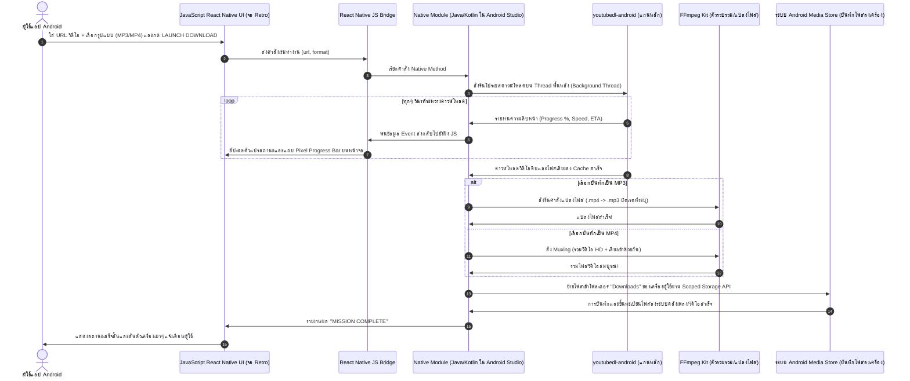

# 📱 พิมพ์เขียวและขั้นตอนการพอร์ตสู่ Android Studio (React Native JavaScript)

เอกสารฉบับนี้สรุปวิธีการสร้างโปรเจกต์ดาวน์โหลดวิดีโอและไฟล์เสียง ด้วยระบบ React Native CLI เพื่อให้สามารถเปิด รัน คอมไพล์ และปรับแต่งโค้ดส่วนของ Native Libraries ผ่านทาง Android Studio ได้อย่างราบรื่น

---

## 📂 โครงสร้างโปรเจกต์เมื่อเปิดด้วย Android Studio

เมื่อเราสร้างโปรเจกต์แบบ React Native CLI เราจะเขียนโค้ดภาษา JavaScript (UI & App Logic) อยู่ที่โฟลเดอร์หลักภายนอก แต่เมื่อเราต้องการตั้งค่าคอนฟิก, แก้ไขสิทธิ์, จัดการ Gradle หรือตรวจสอบ Logcat เราจะเปิดโฟลเดอร์ย่อย `/android` ด้วย Android Studio ครับ

```text
MyRetroDownloader/             <-- โฟลเดอร์หลัก (เราแก้ JS/TS, package.json ที่นี่)
├── App.javascript             <-- ไฟล์หน้าจอหลักสไตล์ Retro-Pixel (UI Code)
├── package.json               <-- รายการ Dependency ของ JS (เช่น ffmpeg-kit-react-native)
└── android/                   <-- ** โฟลเดอร์สำหรับเปิดใน Android Studio **
    ├── app/
    │   ├── build.gradle       <-- คอนฟิกแอปหลัก, การเปิดใช้ Proguard, ย่อขนาด APK
    │   └── src/
    │       └── main/
    │           ├── AndroidManifest.xml  <-- การประกาศขอสิทธิ์ (Permissions)
    │           └── java/com/retrodownloader/
    │               └── MainActivity.java
    ├── build.gradle           <-- คอนฟิก Gradle ระดับโปรเจกต์หลัก (ตั้งค่า Maven, เวอร์ชัน Kotlin)
    └── settings.gradle        <-- การตั้งค่าโมดูลย่อย
```

---

## 🛠️ ขั้นตอนการเซตอัปและเริ่มต้นพัฒนา

### 1. การสร้างโปรเจกต์ใหม่และติดตั้ง Dependency
เปิด Terminal บนเครื่องคอมพิวเตอร์ของคุณ แล้วรันคำสั่งเพื่อสร้างโปรเจกต์ React Native (แนะนำให้ไม่ใช้ Expo เพื่อให้การเปิดใน Android Studio ไม่มีปัญหาเรื่อง Wrapper ซ้อนกัน)

```bash
# สร้างโปรเจกต์ใหม่ด้วย React Native CLI
npx react-native init RetroDownloader

# เข้าสู่โฟลเดอร์โปรเจกต์
cd RetroDownloader

# ติดตั้งคลังไลบรารีดาวน์โหลดและแปลงไฟล์เสียง/วิดีโอ
npm install ffmpeg-kit-react-native

# ติดตั้งไลบรารีจัดการไฟล์และการเข้าถึง Storage
npm install react-native-fs
```

> [!NOTE]
> ในส่วนของแกนดาวน์โหลด `youtubedl-android` มักจะต้องใช้ Native Bridge ในการเชื่อมต่อผ่านไฟล์ Java/Kotlin ซึ่งเป็นจุดเด่นมากที่เราใช้ Android Studio เพราะสามารถเขียน Native Module เพื่อรับคำสั่งจาก JavaScript แล้วเรียกใช้ไลบรารีนี้ในฝั่ง Java ได้ทันที!

### 2. คอนฟิก Gradle สำหรับ Android Studio (สำคัญมาก)
เปิดโฟลเดอร์ `RetroDownloader/android` ด้วยโปรแกรม Android Studio รอให้ Gradle Sync ทำงานจนเสร็จ จากนั้นให้ทำการปรับแต่งไฟล์ต่างๆ ดังนี้เพื่อรองรับ FFmpeg และแกนประมวลผลวิดีโอ:

#### **A. ตั้งค่า Gradle ระดับโปรเจกต์ (`android/build.gradle`)**
เนื่องจากไลบรารีด้านการดาวน์โหลดและแปลงสัญญาณบางตัวอาจต้องการพื้นที่ Maven เฉพาะตัว ให้ตรวจสอบการประกาศคลังดาวน์โหลดในบล็อก `allprojects`:
```gradle
allprojects {
    repositories {
        mavenCentral()
        maven { url "https://jitpack.io" } // สำหรับดึงไลบรารีโอเพนซอร์สย่อยๆ
    }
}
```

#### **B. ตั้งค่า Gradle ระดับแอป (`android/app/build.gradle`)**
ไฟล์นี้เป็นจุดที่ระบุวิธีการบีบอัดขนาดของแอปและการเปิดใช้งาน FFmpeg Kit (เนื่องจาก FFmpeg มีขนาดใหญ่มาก หากไม่ระบุรุ่นที่ต้องการใช้ ขนาดไฟล์ติดตั้ง .apk ของคุณจะเกิน 100MB+) ให้ทำการปรับปรุงไฟล์ดังนี้:
```gradle
android {
    ...
    defaultConfig {
        applicationId "com.retrodownloader"
        minSdkVersion 24 // กำหนดขั้นต่ำที่ระบบต้องการ (FFmpeg kit ต้องการขั้นต่ำ api 24)
        targetSdkVersion 34
        versionCode 1
        versionName "1.0"
        
        // กำหนดเวอร์ชันสถาปัตยกรรมชิปที่ต้องการซัพพอร์ต (เพื่อป้องกันไม่ให้แอปใหญ่เกินไป)
        ndk {
            abiFilters "armeabi-v7a", "arm64-v8a", "x86_64"
        }
    }

    // กำหนดแพ็กเกจของ FFmpeg Kit ที่ต้องการใช้ (เช่น แพ็กเกจ min-gpl สำหรับการแปลง MP3 ทั่วไป)
    packagingOptions {
        pickFirst "lib/armeabi-v7a/libffmpegkit.so"
        pickFirst "lib/arm64-v8a/libffmpegkit.so"
        pickFirst "lib/x86_64/libffmpegkit.so"
    }
    
    buildTypes {
        release {
            // เปิดใช้ระบบช่วยย่อขนาดโค้ดและไลบรารีที่ไม่จำเป็นทิ้ง (Proguard)
            minifyEnabled true
            shrinkResources true
            proguardFiles getDefaultProguardFile("proguard-android-optimize.txt"), "proguard-rules.pro"
        }
    }
}
```

---

## 🔄 3. ลำดับเหตุการณ์บน Android (The Android Flow Diagram)

เมื่อมีการคลิกปุ่มดาวน์โหลดบนมือถือ ลำดับการประมวลผลและการรายงานผลจะรันผ่านกลไกภายในระบบปฏิบัติการ Android ดังแผนภาพด้านล่างนี้:



---

## 💡 คำแนะนำสำหรับการพัฒนาและดีบัก (Developer Tips)

1. **ดู Log สตรีมสถานะแบบเรียลไทม์**: In Android Studio ให้เปิดแท็บ **Logcat** ที่อยู่ขอบล่างของโปรแกรม แล้วกรองคำว่า `react-native` หรือ `FFmpegKit` เพื่อส่องดู Log ข้อความรายละเอียดการแปลงไฟล์อย่างละเอียด
2. **ปัญหาสิทธิ์การเข้าถึงไฟล์บน Android 10-14**: หากแอปไม่สามารถเซฟไฟล์ลงในเครื่องได้ ให้ใช้โมดูลของ React Native ชื่อ `PermissionsAndroid` เพื่อให้ระบบหน้าจอแสดงผลถามยืนยันขออนุญาตบันทึกข้อมูลก่อนเริ่มสตรีมไฟล์ดาวน์โหลดเสมอ
3. **อัปเดตแกนดาวน์โหลดจาก Java**: ข้อได้เปรียบของการใช้ Android Studio คือคุณสามารถเขียนโค้ดภาษา Java เพื่อสั่งให้ `youtubedl-android` ดาวน์โหลดไฟล์ไบนารีตัวอัปเดตล่าสุดจาก GitHub มารองรับการเปลี่ยนแปลงของแพลตฟอร์มปลายทางได้ทันทีโดยไม่ต้องรอลูกค้ากดอัปเดตตัวแอปผ่าน Store ครับ
